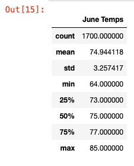

# Surfs Up

For this part of the Challenge, write a report that describes the key differences in weather between June and December and two recommendations for further analysis.

The analysis should contain the following:

## Overview of the analysis: 

Explain the purpose of this analysis.

## Results: 

Provide a bulleted list with three major points from the two analysis deliverables. Use images as support where needed.

## Summary: 

Provide a high-level summary of the results and two additional queries that you would perform to gather more weather data for June and December.

Histogram by station and Scatter plot of precip vs temp by station to see if Oahu weather is localized (micro-climates), similar to the plots we did for the PyBer analysis.